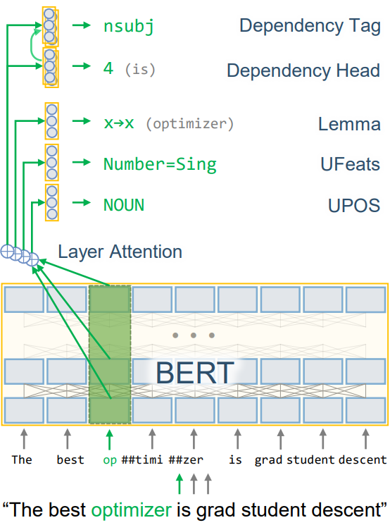

# UDify

[](LICENSE)

UDify is a single model that parses Universal Dependencies (UPOS, UFeats, Lemmas, Deps) jointly, accepting any of 75 
supported languages as input (trained on UD v2.3 with 124 treebanks). This repository accompanies the paper, 
"[75 Languages, 1 Model: Parsing Universal Dependencies Universally](https://arxiv.org/abs/1904.02099)," 
providing tools to train a multilingual model capable of parsing any Universal Dependencies treebank with high 
accuracy. This project also supports training and evaluating for the 
[SIGMORPHON 2019 Shared Task #2](https://sigmorphon.github.io/sharedtasks/2019/task2/), which achieved 1st place in 
 morphology tagging (paper can be found [here](https://www.aclweb.org/anthology/W19-4203)).

Integration with SpaCy is supported by [Camphr](https://github.com/PKSHATechnology-Research/camphr).

[](https://arxiv.org/pdf/1904.02099.pdf)

The project is built using [AllenNLP](https://allennlp.org/) and [PyTorch](https://pytorch.org/).

## Getting Started

Install the Python packages in `requirements.txt`. UDify depends on AllenNLP and PyTorch. For Windows OS, use 
[WSL](https://docs.microsoft.com/en-us/windows/wsl/install-win10). Optionally, install TensorFlow to get access to 
TensorBoard to get a rich visualization of model performance on each UD task.

```bash
pip install -r ./requirements.txt
```

Download the UD corpus by running the script

```bash
bash ./scripts/download_ud_data.sh
```

or alternatively download the data from [universaldependencies.org](https://universaldependencies.org/) and extract 
into `data/ud-treebanks-v2.3/`, then run `scripts/concat_ud_data.sh` to generate the multilingual UD dataset.

### Training the Model

Before training, make sure the dataset is downloaded and extracted into the `data` directory and the multilingual 
dataset is generated with `scripts/concat_ud_data.sh`. To train the multilingual model (fine-tune UD on BERT), 
run the command

```bash
python train.py --config config/ud/multilingual/udify_bert_finetune_multilingual.json --name multilingual
```

which will begin loading the dataset and model before training the network. The model metrics, vocab, and weights will
be saved under `logs/multilingual`. Note that this process is highly memory intensive and requires 16+ GB of RAM and 
12+ GB of GPU memory (requirements are half if fp16 is enabled in AllenNLP, but this [requires custom changes to the library](https://github.com/allenai/allennlp/issues/2149)). 
The training may take 20 or more days to complete all 80 epochs depending on the type of your GPU.

### Training on Other Datasets

An example config is given for fine-tuning on just English EWT. Just run:

```bash
python train.py --config config/ud/en/udify_bert_finetune_en_ewt.json --name en_ewt --dataset_dir data/ud-treebanks-v2.3/
```

To run your own dataset, copy `config/ud/multilingual/udify_bert_finetune_multilingual.json` and modify the following
json parameters:

- `train_data_path`, `validation_data_path`, and `test_data_path` to the paths of the dataset conllu files. These can
be optionally `null`.
- `directory_path` to `data/vocab/<dataset_name>/vocabulary`.
- `warmup_steps` and `start_step` to be equal to the number of steps in the first epoch. A good initial value is in the 
range `100-1000`. Alternatively, run the training script first to see the number of steps to the right of the progress 
bar.
- If using just one treebank, optionally add `xpos` to the `tasks` list.

### Viewing Model Performance

One can view how well the models are performing by running TensorBoard

```bash
tensorboard --logdir logs
```

This should show the currently trained model as well as any other previously trained models. The model will be stored 
in a folder specified by the `--name` parameter as well as a date stamp, e.g., `logs/multilingual/2019.07.03_11.08.51`.

## Pretrained Models

[Pretrained models can be found here](http://hdl.handle.net/11234/1-3042). This can be used for predicting conllu 
annotations or for fine-tuning. The link contains the following:

- `udify-model.tar.gz` - The full UDify model archive that can be used for prediction with `predict.py`. Note that this 
model has been trained for extra epochs, and may differ slightly from the model shown in the original research paper.
- `udify-bert.tar.gz` - The extracted BERT weights from the UDify model, in 
[huggingface transformers (pytorch-pretrained-bert)](https://github.com/huggingface/transformers) format.

## Predicting Universal Dependencies from a Trained Model

To predict UD annotations, one can supply the path to the trained model and an input `conllu`-formatted file:

```bash
python predict.py <archive> <input.conllu> <output.conllu> [--eval_file results.json]
```

For instance, predicting the dev set of English EWT with the trained model saved under 
`logs/model.tar.gz` and UD treebanks at `data/ud-treebanks-v2.3` can be done with

```bash
python predict.py logs/model.tar.gz  data/ud-treebanks-v2.3/UD_English-EWT/en_ewt-ud-dev.conllu logs/pred.conllu --eval_file logs/pred.json
```

and will save the output predictions to `logs/pred.conllu` and evaluation to `logs/pred.json`.

## Configuration Options

1. One can specify the type of device to run on. For a single GPU, use the flag `--device 0`, or `--device -1` for CPU.
2. To skip waiting for the dataset to be fully loaded into memory, use the flag `--lazy`. Note that the dataset won't be shuffled.
3. Resume an existing training run with `--resume <archive_dir>`.
4. Specify a config file with `--config <config_file>`.

## SIGMORPHON 2019 Shared Task

A modification to the basic UDify model is available for parsing morphology in the 
[SIGMORPHON 2019 Shared Task #2](https://sigmorphon.github.io/sharedtasks/2019/task2/). The following paper describes 
the model in more detail: "[Cross-Lingual Lemmatization and Morphology Tagging with Two-Stage Multilingual BERT Fine-Tuning](https://www.aclweb.org/anthology/W19-4203)".

Training is similar to UD, just 
run `download_sigmorphon_data.sh` and then use the configuration file under `config/sigmorphon/multilingual`, e.g.,

```bash
python train.py --config config/sigmorphon/multilingual/udify_bert_sigmorphon_multilingual.json --name sigmorphon
```

## FAQ

1. When fine-tuning, my scores/metrics show poor performance.

It should take about 10 epochs to start seeing good scores coming from all the metrics, and 80 epochs to be competitive
 with UDPipe Future.

One caveat is that if you use a subset of treebanks for fine-tuning instead of all 124 UD v2.3 treebanks, 
*you must modify the configuration file*. Make sure to tune the learning rate scheduler to the number of 
training steps. Copy the [`udify_bert_finetune_multilingual.json`](https://github.com/Hyperparticle/udify/blob/master/config/ud/multilingual/udify_bert_finetune_multilingual.json) 
config and modify the `"warmup_steps"` and `"start_step"` values. A good initial choice would be to set both to be 
equal to the number of training batches of one epoch (run the training script first to see the batches remaining, to 
the right of the progress bar).

Have a question not listed here? [Open a GitHub Issue](https://github.com/Hyperparticle/udify/issues).

## Citing This Research

If you use UDify for your research, please cite this work as:

```latex
@inproceedings{kondratyuk-straka-2019-75,
    title = {75 Languages, 1 Model: Parsing Universal Dependencies Universally}
    author = {Kondratyuk, Dan and Straka, Milan},
    booktitle = {Proceedings of the 2019 Conference on Empirical Methods in Natural Language Processing and the 9th International Joint Conference on Natural Language Processing (EMNLP-IJCNLP)},
    year = {2019},
    address = {Hong Kong, China},
    publisher = {Association for Computational Linguistics},
    url = {https://www.aclweb.org/anthology/D19-1279},
    pages = {2779--2795}
}
```
